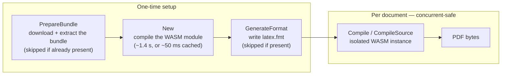
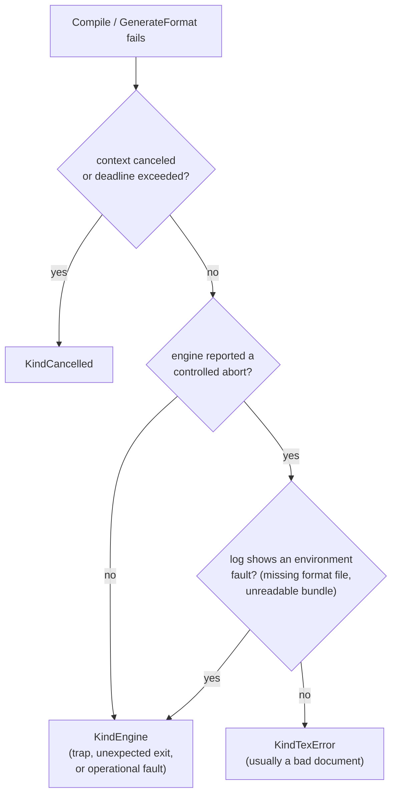

# tecgonic

A Go library that compiles LaTeX documents to PDF using the [Tectonic](https://tectonic-typesetting.github.io/) engine compiled to WebAssembly. No native TeX installation required.

## Features

- Pure Go — the Tectonic engine runs as WASM via [andsifr](https://github.com/mgilbir/andsifr), our optimized fork of [wazero](https://wazero.io/) (no CGo)
- Self-contained bundle — one call (`PrepareBundle`) downloads and caches the TeX Live bundle
- Concurrent compilation — each `Compile` call gets its own isolated WASM instance
- WASM compilation cache — optional on-disk cache cuts startup from ~1.4 s to ~50 ms

## Quick start

```go
package main

import (
	"context"
	"log"
	"os"
	"path/filepath"

	"github.com/mgilbir/tecgonic"
)

func main() {
	if err := run(); err != nil {
		log.Fatal(err)
	}
}

func run() error {
	ctx := context.Background()

	cache, err := os.UserCacheDir()
	if err != nil {
		return err
	}
	bundleDir := filepath.Join(cache, "tecgonic", "bundle")
	wasmCacheDir := filepath.Join(cache, "tecgonic", "wasm-cache")

	// Download the TeX bundle (one-time).
	if err := tecgonic.PrepareBundle(ctx, bundleDir, tecgonic.WithProgress(os.Stderr)); err != nil {
		return err
	}

	// Create the compiler and generate the format file (one-time).
	compiler, err := tecgonic.New(ctx,
		tecgonic.WithDefaultBundleDir(bundleDir),
		tecgonic.WithCompilationCache(wasmCacheDir),
	)
	if err != nil {
		return err
	}
	defer compiler.Close(ctx)
	if err := compiler.GenerateFormat(ctx, ""); err != nil { // "" -> default bundle dir
		return err
	}

	// Compile a single self-contained source to PDF.
	pdf, err := compiler.CompileSource(ctx, []byte(`\documentclass{article}
\begin{document}
Hello, World!
\end{document}
`))
	if err != nil {
		return err
	}
	return os.WriteFile("output.pdf", pdf, 0o644)
}
```

See [examples/simple](examples/simple) for a complete runnable example.

The quick start has two phases — a one-time setup and a per-document compile
that is safe to run concurrently:



## Multi-file documents

`CompileSource` handles a single self-contained source. For documents that pull
in other files — `\input`, `\includegraphics`, `.bib`, or custom `.cls`/`.sty` —
use `Compile` with any `fs.FS` and the name of the main source within it:

```go
fsys := os.DirFS("/path/to/project") // or embed.FS, fstest.MapFS, fs.Sub(...)
pdf, err := compiler.Compile(ctx, fsys, "paper.tex")
```

The filesystem is served to the engine read-only and is never written to the
host; it defines the document's entire input visibility, so it doubles as a
trust boundary you control. References resolve relative to the main source's own
directory (a main source at `src/paper.tex` reads `\input{intro}` as
`src/intro.tex`), and the output PDF is named after the basename (`paper.pdf`).

Because `os.DirFS` follows symlinks out of its root, prefer an in-memory `fs.FS`
(or `fs.Sub` of a vetted tree) for untrusted input. For the full hardening story
— the sandbox guarantees plus the CPU, memory, and disk knobs — see
[docs/untrusted-input.md](docs/untrusted-input.md).

## Error handling

`Compile`, `CompileSource`, and `GenerateFormat` return an `*EngineError` when
the engine run itself fails. Its `Kind` (or the `Is*` helpers) tells you how to
react:

| Kind | Meaning | Typical response |
| --- | --- | --- |
| `KindTexError` | tectonic aborted on a controlled TeX error — usually an invalid document | Return the logs to the document author |
| `KindEngine` | an operational fault: a WASM trap, an unexpected exit, or an environment fault (unloadable format file, missing bundle mount) | Alert on-call |
| `KindCancelled` | the run was cancelled or timed out (only with `WithContextCancellation`) | Retry or report the timeout |

How a failure is classified — the engine signals a controlled abort with a
reserved exit code, so the decision no longer depends on scraping stderr:



```go
pdf, err := compiler.Compile(ctx, fsys, "paper.tex")
if err != nil {
	var engErr *tecgonic.EngineError
	if errors.As(err, &engErr) {
		switch {
		case engErr.IsTexError():
			// Show engErr.Logs to the author.
		case engErr.IsCancelled(): // also: errors.Is(err, context.Canceled)
			// Deadline/cancellation.
		default: // IsEngineFailure()
			// Operational fault — alert.
		}
	}
	return err
}
```

`KindTexError` usually means the document is at fault, but tectonic aborts
through the same channel for one environment fault it only detects mid-run: a
package missing from the bundle. Before routing every `KindTexError` back to the
author, confirm the bundle is the one the document expects. Misconfigurations
that tecgonic *can* detect up front — a nonexistent bundle directory, a bundle
with no `latex.fmt`, a missing fonts directory — fail with a plain error (not an
`*EngineError`) before the engine runs.

## Troubleshooting

| Symptom | Likely cause |
| --- | --- |
| `bundle directory … has no latex.fmt` | `GenerateFormat` was never run against that bundle dir |
| `bundle directory …: no such file or directory` | Wrong `WithBundleDir` / `WithDefaultBundleDir` path |
| `File 'xxx.sty' not found` (a `KindTexError`) | The bundle lacks the package (using the minibundle? a partial bundle?) |
| `main source … must use the .tex extension or none` | Rename the main source to `.tex` (or drop the extension) |
| `bundle stream truncated` from `PrepareBundle` | The download was cut short (a partial/cached object); it retries on the next call |
| Compile ignores a context deadline | `WithContextCancellation` is off by default — enable it (see below) |
| Benchmarks skip with "set `TECGONIC_BUNDLE_DIR`" | The heavy benchmarks need a full bundle; the minibundle lacks their packages |

## WASM compilation cache

Creating a `Compiler` with `New()` involves compiling the Tectonic WASM module, which takes ~1.4 s. Pass `WithCompilationCache(dir)` to cache the compiled module on disk. Subsequent calls load the cached result in ~50 ms — a **~26x speedup**.

```go
compiler, err := tecgonic.New(ctx,
	tecgonic.WithDefaultBundleDir(bundleDir),
	tecgonic.WithCompilationCache("/path/to/cache"),
)
```

Benchmark results (AMD Ryzen 9 6900HX):

```
BenchmarkNew/NoCache       1   1360 ms/op   79 MB/op   117k allocs/op
BenchmarkNew/WithCache    22     51 ms/op  6.8 MB/op    31k allocs/op
```

The cache directory can be shared across processes. The first invocation populates the cache; all later invocations (including from different processes) read from it.

## Context cancellation and performance

By default, `Compile` runs at full speed but does **not** honor context
cancellation or deadlines once a compilation has started: the call runs to
completion regardless of the context, and keeps a CPU core busy until it
finishes.

This is deliberate. Making a running compilation interruptible requires wazero
to insert a termination check on every loop back-edge and function call (its
`WithCloseOnContextDone` option). For CPU-heavy documents — most notably large
`tabularray` `longtblr` tables, which do a lot of expl3 macro expansion per row
— that check dominates runtime. Measured on a ~100-row colored `longtblr` table:

| Mode | Time |
| --- | --- |
| Default (cancellation off) | **34 s** |
| `WithContextCancellation()` | 164 s (**~5× slower**) |

So context cancellation is opt-in. Enable it only when you need to abort or
time out long-running compilations (e.g. untrusted input that could loop), and
accept the per-iteration cost:

```go
compiler, err := tecgonic.New(ctx,
	tecgonic.WithDefaultBundleDir(bundleDir),
	tecgonic.WithContextCancellation(), // interruptible, ~5x slower on heavy docs
)
```

You can reproduce the comparison with:

```bash
TECGONIC_BUNDLE_DIR=/path/to/bundle TECGONIC_BENCH_ROWS=100 \
	go test -run '^$' -bench BenchmarkCompileLongtblr -benchtime=1x .
```

## TeX passes and WithMaxPasses

Tectonic reruns TeX until the document's cross-reference data (`.aux`)
converges, up to 6 passes. Since modern LaTeX always records feedback data in
the aux file (e.g. the total page count), every document compiles with at
least 2 full passes — each pass repeats the entire cost of the document.

If your documents don't use cross-references, citations, tables of contents,
or "page X of Y" counters, you can skip rerun detection and roughly halve
compilation time:

```go
pdf, err := compiler.CompileSource(ctx, tex, tecgonic.WithMaxPasses(1))
```

Measured on the 40-row `longtblr` benchmark document (M1 Pro): 17.4 s default
vs 9.0 s with `WithMaxPasses(1)`, with byte-identical output. Documents that
do need extra passes will render stale or missing references (`??`) when
capped too low, so this is per-call and opt-in.

If you can't know upfront whether a document needs multiple passes, use
`WithStateDir` instead: it persists the feedback files (`.aux`, `.toc`, …)
across `Compile` calls, so the first pass of the next compile starts from the
previous run's data. When the document's feedback is unchanged, the engine
proves convergence after a single pass and skips the rerun — same ~2× speedup
as `WithMaxPasses(1)`, but the multi-pass safety net stays in place: a stale
seed just triggers the usual reruns, never wrong output.

```go
// One state directory per logical document.
pdf, err := compiler.CompileSource(ctx, tex, tecgonic.WithStateDir(stateDir))
```

```bash
TECGONIC_BUNDLE_DIR=/path/to/bundle \
	go test -run '^$' -bench 'BenchmarkCompileLongtblr/cancellation_off|BenchmarkCompileSinglePass|BenchmarkCompileWarmAux' -benchtime=3x .
```

## WASM engine: andsifr (a wazero fork)

The WASM engine is [andsifr](https://github.com/mgilbir/andsifr), a fork of
[wazero](https://github.com/tetratelabs/wazero) with its own module path. It
carries compiler optimizations that target exactly tecgonic's workload — an
interpreter-style module whose state lives in globals at constant addresses:

- **Bounds-check elision for statically safe addresses**: accesses at
  constant addresses within the memory's declared minimum size can never be
  out of bounds (memories only grow), so no runtime check is emitted.
- **Shared trap islands** (arm64 and amd64): conditional traps branch to one
  shared per-function exit sequence and fall through on the hot path, instead
  of inlining ~10 instructions at every check site.

Measured on the 40-row `longtblr` benchmark document:

| CPU | stock wazero v1.12.0 | andsifr |
| --- | --- | --- |
| Apple M1 Pro | 16.4 s | **9.8 s (1.7x)** |
| Intel i7-3770 | 38.8 s | **19.3 s (2.0x)** |

Generated machine code for the module also shrinks from 18.2 MB to 10.8 MB.
The full wazero test suite and the WebAssembly spec tests pass on the fork on
both linux/amd64 and darwin/arm64.

Because andsifr is an ordinary dependency (not a `replace` directive),
applications importing tecgonic as a library get it automatically — no
changes to your `go.mod` are needed.

## Development

Requires the Go toolchain declared in [`go.mod`](go.mod) (currently Go 1.25) or newer.

```bash
make test   # go test ./...
make lint   # golangci-lint run ./... (see .golangci.yml)
```

Tests run with no setup: `TestMain` extracts a small committed bundle
(`testdata/minibundle.tar.gz` — `article.cls`, Latin Modern, and a prebuilt
`latex.fmt`, enough for the compile tests) into a temp directory. To run against
a full bundle instead (more fonts, document classes, and benchmarks), point
`TECGONIC_BUNDLE_DIR` at an extracted bundle that includes `latex.fmt`:

```bash
TECGONIC_BUNDLE_DIR=/path/to/bundle go test ./...
```

The `longtblr` benchmarks (`BenchmarkCompileLongtblr`, `…SinglePass`,
`…WarmAux`) need a full bundle for their packages; without `TECGONIC_BUNDLE_DIR`
they skip. `BenchmarkCompileSimple` runs against the minibundle.

## Building the WASM module

The pre-built WASM artifact is included under `wasm/`. To rebuild it from the Tectonic source:

```bash
make wasm
```

This uses Docker to cross-compile Tectonic to `wasm32-wasip1`. Pin a reproducible
source revision with `make wasm TECTONIC_REF=<commit-sha>`; changing the ref also
busts the Docker git-clone cache, so a rebuild after an upstream push picks up the
new source without needing `--no-cache`. See the [Dockerfile](Dockerfile) for details.

## Thanks

This project would not be possible without:

- [Tectonic](https://tectonic-typesetting.github.io/) — a modernized, complete, self-contained TeX/LaTeX engine. Tectonic does all the heavy lifting of turning LaTeX into PDF; tecgonic simply makes it callable from Go.
- [wazero](https://wazero.io/) — a zero-dependency WebAssembly runtime for Go. wazero makes it practical to embed the Tectonic WASM binary in a pure-Go library with no CGo and no external dependencies.

## License

MIT — see [LICENSE](LICENSE).